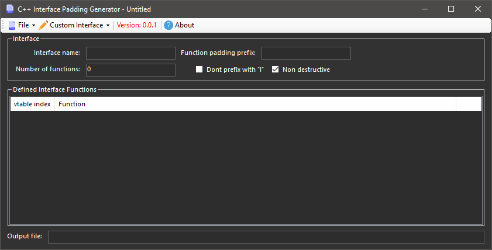

# C++ Interface padding generator
Automatically generates function padding for C++ interface classes 

## Features
* **Save and load instances** - Save/Load sessions as an .ipg file complete with all the options, output file, and defined interface functions allowing the ease of re-generating interface classes with small changes
* **Non destructive Option** - When checked IPG analyzes the file and only overwrites virtual functions leaving custom functions, includes, comments, inherits, etc... untouched.

## Development
### Prerequisite
* [Json.NET](https://www.newtonsoft.com/json) Framework for handling the Json format used for the IPG file ([NuGet](https://www.nuget.org/packages/Newtonsoft.Json/))

## Attribution
* Icons made by iconixar, kiranshastry from www.flaticon.com

## License
MIT